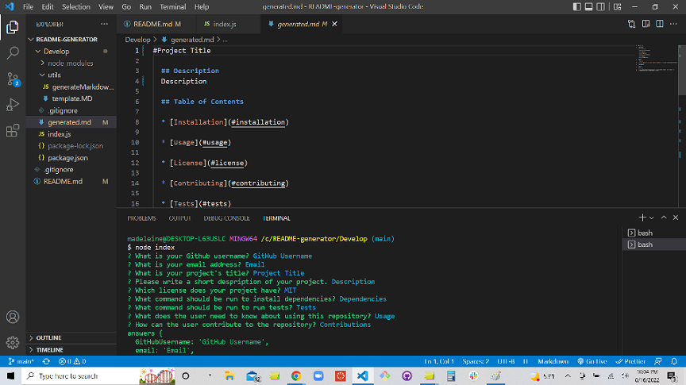

# Professional README Generator Starter Code

The Inquirer package is used to run a README generator for the the command line. 

When the program is started, the user is promped to answers questions about their project in the command line. Data is gathered about the project's title, description, license, dependencies, tests, usage and contributions. The user is also prompted to answer contact info questions, such as email and github username. If no data is entered, default placeholder text will be used. 

A professional README is then generated using writeToFile, and the README is saved under "generated.md" in the library. A license badge is populated on the file depending on the license the user chose.

link to repository: https://github.com/mconanan/README-generator

 

link to screencastify: https://watch.screencastify.com/v/iANd7AtANVigZ4RFFBIh